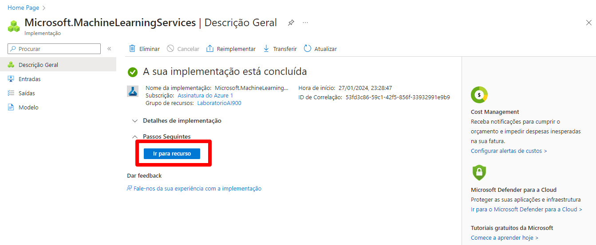

# Trabalhando com Machine Learning na Prática no Azure ML

## Passo 1: Criando recurso do Azure Machine Learning

Criando um recurso de Machine Learning. Cliquei em "Criar recurso" e posteriormente foi buscado pelo Azure Machine Learning no marketplace. Encontrar o recurso, crie ele.

## Passo 2: Configurando o recurso do Azure Machine Learning

Na aba de Noções básica, Detalhes do recurso, é informei a assinatura para cobrança no campo Assinatura e depois informei o Grupo de recursos que vai englobar o recurso que será criado.

Após, em Detalhes da área de trabalho, é informei os detalhes do workspace que será criado. Como foi um laboratório, as configurações foram mínimas. Por fim, criei o recurso clicando em Consultar + criar. Após a validação ser aprovada, cliquei em "Criar".

Após o recurso ser criado, cliquei no botão "Ir para o recurso" para acessar a página do recurso.

Nessa página, existe o botão "Iniciar o estúdio" que redirecionará para o estúdio do Azure Machine Learning.

## Passo 3 - Criando o modelo

A página do "Workspace" criado anteriormente, acessada a opção do menu ML automatizado, selecinada a opção em "Novo trabalho de ML automatizado".

## Passo 4: Modelo com as métricas

Acessando as métricas do modelo treinado na página do modelo, acesso o link em "Criado por trabalho". Também é possível acessar o trabalho informado na opção do menu "Tarefas (jobs)".

## Passo 5: Testando o modelo

Para o teste, utilizei o json abaixo:

<code>
{
  "input_data": {
    "data": [
       {
         "day": 1,
         "mnth": 1,   
         "year": 2022,
         "season": 2,
         "holiday": 0,
         "weekday": 1,
         "workingday": 1,
         "weathersit": 2, 
         "temp": 0.3, 
         "atemp": 0.3,
         "hum": 0.3,
         "windspeed": 0.3 
       }
     ]
  }
}
</code>

A previsão gerada foi: 361.95

